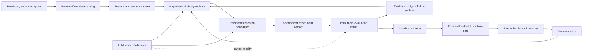

# ARAD 材料审计与产品形态

## 1. 结论先行

ARAD 的最终形态不应是“一个不停让 LLM 改因子公式的脚本”，而应是一个**持续运行的另类数据研究操作系统**：

1. 大模型负责经济机制生成、研究选题、语义审查、反驳和下一步规划。
2. 确定性内核负责数据可用时间、实验冻结、功效、多重检验、回测、成本、正交性和生命周期判决。
3. 所有尝试进入追加式 Evidence Ledger；否定结果是资产，不因“没找到 alpha”而丢弃。
4. 全局服务不因模型输出 `stop`、局部空间枯竭或一次无结果而结束；它切换搜索邻域、研究家族、品种、时域、数据源，或进入等待新数据后的复验队列。
5. 系统追求一组多样化、可替换的因子库存，但不伪造“必然找到 N 个有效因子”的科学保证。

真正可以承诺的是：**在既定算力和数据预算内持续产生可审计 Study 判决，维护候选与生产因子库存，并在因子衰减时自动触发复核与替代研究。**

## 2. 已审计材料

### 2.1 autoresearch 模板

`/Users/xinyu/Code/AR-Polymarket/autoresearch` 提供了四个值得继承的结构：固定评估器、有界实验单元、keep/discard 账本、默认持续运行。它的单文件变异、单指标排序和五分钟训练预算不适合直接搬到量化研究；量化系统必须有不可降级的多层闸门和不可触碰的最终留出。

### 2.2 Feature Intelligence Layer 与访谈设计

两份材料共同要求：

- Feature 是带经济含义的事实，不是任意数学变换。
- Feature 必须记录经济假设、预期方向、时域、适用域、来源和失败条件。
- 研究流程必须包含事前假设锁、PIT、功效、多重检验、四层正交性、成本容量和生命周期。
- LLM 输出本身是派生数据，必须保存输入快照、提示词、模型版本、证据、时间戳、置信度与泄漏风险。
- 研究目标是组合边际价值，不是孤立 Sharpe 排行榜。
- 需要通过不同机制、提示词、模型和工具抑制“研究输出熵坍缩”。

这些要求构成 ARAD 的治理层，而不是报告附录。

### 2.3 Alpha-Data 的既有实证

现有报告已经排除了很多表面显著结果：

- 同窗吸收比稳定的分钟级领先更常见。
- 191 个 market-level 事件实际只有约 72 个独立 episode，按市场行计算会严重虚增样本量。
- 大豆粕的候选结果未通过 BH-FDR 与影响点诊断，不能称为因子。
- 中东风险与原油的稳健发现主要是同窗吸收和波动关系，不等同于可交易 alpha。
- 新市场创建、概率跳跃、成交量爆发是不同机制，不能混成统一事件。
- Polymarket “价格”可能是领先信息，也可能只是期货和公开新闻的跟随者；必须残差化和控制。

因此新项目不能把旧报告里的强 t 值当先验答案。它们只可作为基准 Study、已知失败模式和测试夹具。

### 2.4 ADAR v1-v3 的演化

v1 的贡献是完整留痕、真实成交约束和事件/组合分层；缺点是预设“必须产出策略”，且对数据范围和订单簿能力有错误假设。

v2 把问题改写为端点、机制路径与市场—品种配对，强调一对一语义映射、公共新闻控制、MDE 预检和污染样本隔离。

v3 最重要的修正是：Study 才是工作单元，统计功效而非想法数量是当前瓶颈；`null`、`underpowered` 和负面记忆必须成为一等产物。已记录的真实故障包括：

- 09:30 窗口混入集合竞价信息；
- 微秒时间戳误按纳秒解析，导致新闻控制全零；
- 24 小时 staleness 规则误杀周一；
- jump 没有切断 drift 段；
- 漏掉离岸市场窗口控制使 t 值从 3.201 变为 -0.165；
- 聚合条件读取了结果变量；
- 名义样本 221、t 值 5.48 的结果实际 `n_eff=1`。

新仓库应继承这些测试思想与知识，但不复制旧架构。

## 3. 数据现实与风险

### 3.1 中国商品期货 tick

源：`/Users/xinyu/Code/AR-Polymarket/chinese-commodity`

- 约 221 GB，共 66 个 zip；实际覆盖为 2022-11 至 2026-07-30，而非 2022 全年。
- 2022-2024 按年份子目录，2025-2026 月包位于根目录，2026-07 又改为日包。
- 字段包括 TradingDay、InstrumentID、UpdateTime、毫秒、成交价、累计成交量、买卖一档、均价、成交额、持仓和涨跌停。
- 文件含逐合约数据，也含 `主力连续` 类副本；后者经逐字节校验是当日主力合约文件的完全相同副本（非拼接序列），其 `InstrumentID` 列保留真实合约代码，因此换月时点可从数据自身恢复。文件名乱码是 CP437 存储的 GBK，可确定性解码。品种大小写不统一（郑商所大写、其余小写），郑商所合约代码为三位数字需补世纪位。
- Volume、Turnover 是累计量，夜盘的 TradingDay 与自然日不同；合约换月、交易时段、午休、夜盘归属都必须显式建模。

第一阶段不能直接依赖来源自带的“主力”副本。应从逐合约数据确定性地产生合约状态、主力选择和连续序列，并保存换月决策。

### 3.2 Polymarket

源：`/Users/xinyu/Code/AR-Polymarket/AlternativeAR/Alpha-Data/data`

- `daily_aligned` 覆盖 2022-11-21 至 2026-04-28，共 1,248 个日分区，约 6.02 亿行；其设计排除了 negRisk/多结果市场。
- 自有链上抓取在协议迁移后继续覆盖，日分析分区包含 protocol、exchange、block_number、log_index 和二元市场标记。
- 现有 `asset_map` 约 351 万行，`markets_clob` 约 177 万行。
- `block_timestamp` 是保守的链上可用时间，不等于更早的 CLOB 撮合时间；旧实验测得链上延迟约 2.16 秒，但不能把平均延迟当逐笔真值。
- 新旧 ABI、交易所地址、relay legs、未知 venue 和资产映射都需要质量闸门。
- 2022-2023 活跃度低，主要可研究期从 2024 开始。

ARAD 应只读消费 Alpha-Data 的冻结产物，通过 adapter 与 manifest 绑定版本；不能在研究时静默重抓或重写来源数据。

### 3.3 财联社新闻

源：`/Users/xinyu/Code/AR-Polymarket/Crawler/cls-data/data/output`

- 2,361 个日 CSV，实际覆盖 2020-01-01 至 2026-06-18。
- 字段为 Index、Time、Title、Content、Labels、Reads、Comments、Shares。
- 历史接口仅返回 `in_roll=1`。爬虫目录文档声称回填仅为实时口径的 70%，但该结论经独立逐日比对已被证伪：把实时快照按正文日期戳重新归日后，回填覆盖率为 99% 至 100%，且每日比实时样本多 37 至 57 条（详见 `docs/00-material-analysis.md` §2.3）。残余不确定性只剩"发布后即被移出滚动列表"的极小比例。
- 日期来自文件名，Time 为北京时间；需要组合为带时区的 publication/availability time。
- Reads、Comments、Shares 是抓取时累计值，历史研究中存在未来信息，不得作为预测特征。

财联社在 MVP 中首先承担**公共信息控制变量**，其次才是独立特征源。模型抽取必须保留原文证据和版本，不能用模型知识替代当时已公开内容。

## 4. 旧系统提前停止的确定性诊断

我们为旧 ADAR 的 daily cognition loop 构造了一个最小复现。模型在第一次咨询返回 `stop=true` 后，实际 `n_experiments=1`，而预算仍大于 1；源码和现有测试都把这一行为当成预期：

1. `study/cognition.py` 的提示词明确允许全局 stop，循环收到后直接 `break`。
2. 连续两次空咨询、30 个不可执行计划、10 次不可行随机变异也会全局退出。
3. 后来的 `cognition_futures.py` 已改成正确语义：stop 只结束一个 Episode，随后从新基线重启直至预算耗尽。
4. campaign 在搜索空间耗尽后会生成新假设，但新清单只在“下一场战役”生效，因此当前 campaign 仍立即结束；已有产物出现 0 round、0 test、却接受了 6 个扩展提案的状态。

所以需要修复的不是一句“永不停止”提示词，而是三层状态机：

| 层级 | 合法结束条件 | 结束后的动作 |
|---|---|---|
| Search Episode | 邻域枯竭、预算到达、模型建议换线 | 保存局部最优与失败原因，创建新 Episode |
| Study | 得到明确 Verdict 或不可恢复 error | 写入 Evidence Ledger，更新队列 |
| Research Service | 仅人工 pause/shutdown | 持久化 checkpoint；resume 后继续 |

`stop` 不属于顶层模型可写字段。当前无可运行 Study 时，服务进入 `WAITING_FOR_DATA`、`EXPANDING_SEARCH_SPACE` 或 `REVALIDATING`，而不是 `COMPLETED`。

## 5. 产品北极星与约束

### 5.1 北极星

在不降低任何统计、PIT、成本或正交性闸门的前提下，最大化单位研究预算产生的**新增可信信息**与**因子库存边际价值**。

新增可信信息包括可信 null、明确 underpowered、发现数据缺口、候选因子和衰减证据，而不仅是正结果。

### 5.2 双重目标

系统同时维护：

- Research throughput：每周完成的可审计 Study、覆盖的新机制单元、失败复用率和复现率。
- Factor inventory health：按机制×品种×时域×风险暴露的候选/生产覆盖、相关性、成本后贡献、衰减与替换缺口。

不能用“找到多少显著因子”作为优化目标，否则会直接奖励 p-hacking。

### 5.3 不可妥协项

- LLM 不能访问最终留出结果、不能修改 evaluator、不能改统计门槛、不能删除失败记录。
- 新增候选必须计入其完整 Experiment Family 分母；筛掉的提案仍计数。
- 时间切分必须 purge/embargo；重叠 market、事件和窗口按 Episode 聚类。
- 先锁机制与方向，再读取目标结果；任何变更产生新版本和新分母。
- 极值默认保留，使用稳健估计和影响诊断；只有确定的数据错误才删除。
- 生产准入看成本后、容量、稳定性和组合边际价值，不看单一 Sharpe。
- 系统可以提高门槛，不能因为样本不足或没结果而降低门槛。

## 6. 目标系统形态

建议以单体深模块起步，而不是过早拆成多服务。关键边界是：

- `data_catalog`：只读源适配、覆盖、质量、可用时间、版本与哈希。
- `temporal`：交易日、夜盘、事件 Episode、as-of join、purge/embargo。
- `research_registry`：Hypothesis Lock、Study、Experiment Family、不可变版本。
- `feature_store`：Feature Object、物化值、证据和血缘。
- `evaluation`：唯一有权读取 target/holdout 的确定性内核。
- `orchestrator`：持久队列、预算、重试、Episode 重启、人工暂停。
- `memory`：Evidence Ledger、Failure Archive、语义/机制/经验去重。
- `inventory`：候选、生产、降级、重校准、退役和替代需求。
- `providers`：可替换的模型接口；核心状态不得绑定 Claude 或 OpenAI 私有格式。

## 7. 第一个研究切片

第一条 vertical slice 应验证整条协议，而不是追求最强回测：

**问题**：Polymarket 地缘政治概率创新，在中国原油 SC 闭市期间是否为下一交易时段的开盘跳空、日内波动或短时回撤提供相对于全球油价和财联社新闻的增量信息？

选择它的原因：机制直接、既有结果足以构造回归测试、SC tick 有盘口、旧系统已暴露泄漏与控制错误。它同时允许得到 candidate、null 或 underpowered，三者都能验证平台。

它不是预注册结论。第二批基线家族应覆盖：

- 数值型市场的概率阶梯 → 隐含中位数变化 → SC/AU/AG 等直接报价品种；
- 临近期限 hazard 变化 → 对应商品的波动与尾部风险；
- Polymarket 创新在公开新闻、国际资产和商品自身信息上的残差 → 下一可交易窗口；
- 跨市场分歧/分散度 → 风险状态，而非预设方向收益。

## 8. 样本治理建议

截至 2026-08-05，建议这样标记而不是假装拥有真正未触碰留出：

- 2022-11 至 2023-12：覆盖与机制校准期；Polymarket 活跃度低，不承担主要确认。
- 2024：发现期。
- 2025：历史 walk-forward 验证期。
- 2026-01 至 2026-07：污染审计期；既有报告和人工已经反复查看，不能称最终留出。
- 冻结 ARAD 协议后的新到数据：最终前向留出；只有它可以把 Candidate 升级为 Production。

历史 pseudo-OOS 可以开发与淘汰，但所有报告必须清楚标注 `historical_validation`，不能写成 `final_confirmation`。

## 9. “完成”的定义

ARAD v1 完成不等于“找到了几个因子”，而是以下能力全部真实可运行：

1. 三类数据源有可复现、只读、PIT 的 coverage manifest。
2. 一项 Study 能从锁定、功效预检、运行、诊断到判决完整回放。
3. 故意注入的时间泄漏、结果依赖过滤、episode 重复、单位错误都会被测试拦截。
4. 模型输出 stop、空计划、坏 JSON 或 provider 故障不会结束服务。
5. 搜索空间耗尽后，新提案可在同一 Research Program 注册并继续运行。
6. 所有提案和变体进入分母与 Evidence Ledger，无法只保存赢家。
7. Candidate 不能绕过前向留出、成本和组合闸门进入 Production。
8. Production Factor 有监控、降级、退役与替代队列。

因子数量应作为可配置的库存覆盖目标，例如每个核心机制桶至少保持若干互相低相关 Candidate，但它是调度优先级，不是降低证据门槛的理由。
