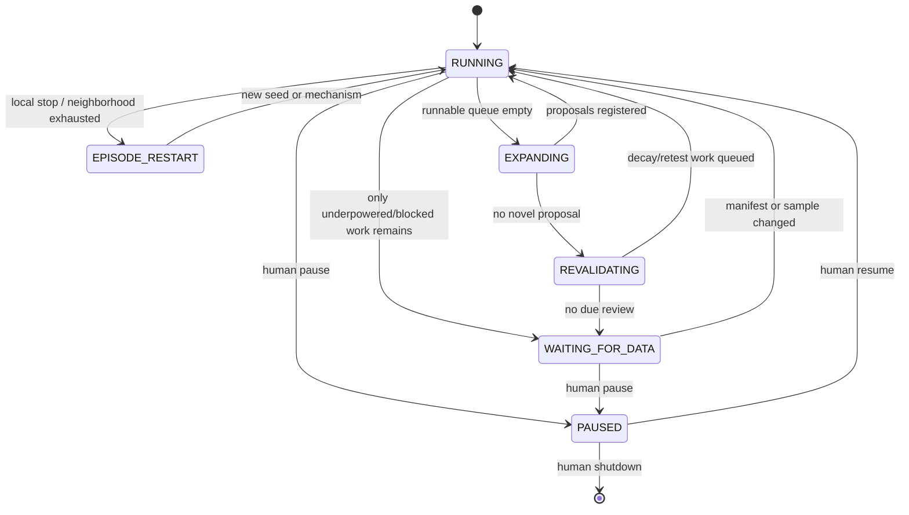

# ARAD 实施计划

## 1. 实施方式

采用“端到端 tracer bullet + 不可变闸门”的方式建设。每一阶段都交付可运行能力、契约、测试和真实小样本产物；不先搭一个庞大的多 Agent 框架，再等待数据与统计层补齐。

优先做单进程、可持久恢复的模块化单体。只有当真实运行证明吞吐瓶颈存在时，才拆 worker 或服务。

## 2. 建议仓库骨架

以下是目标结构，不在设计阶段提前生成空目录：

```text
ARAD/
├── CONTEXT.md
├── pyproject.toml
├── config/
│   ├── data_sources.yaml
│   ├── research_programs.yaml
│   └── gates/
├── docs/
├── schemas/
│   ├── observation.json
│   ├── feature.json
│   ├── hypothesis_lock.json
│   ├── study.json
│   └── factor.json
├── src/arad/
│   ├── data_catalog/
│   ├── temporal/
│   ├── features/
│   ├── registry/
│   ├── evaluation/
│   ├── orchestrator/
│   ├── memory/
│   ├── inventory/
│   ├── providers/
│   └── cli.py
├── tests/
│   ├── contracts/
│   ├── leakage/
│   ├── statistics/
│   ├── orchestration/
│   └── integration/
└── artifacts/                 # gitignored; manifests可提交，大数据不提交
```

默认依赖建议保持克制：Python 3.11+、Polars/PyArrow/DuckDB、NumPy/SciPy/statsmodels、Pydantic、PyYAML、pytest、ruff。调度存储先用 SQLite WAL；数据产物用 Parquet；追加式事件用 JSONL 或 SQLite event table。不要把模型 SDK 类型泄漏进领域对象。

## 3. Phase 0 — 设计基线（本轮完成）

### 交付

- 材料与数据现实审计。
- 产品北极星、反目标和停止语义。
- 统一领域语言。
- 依赖顺序明确的 Decision Map。
- 可直接交给 Codex/Claude 的工程提示词。

### 出口条件

- 所有参与者接受“持续研究服务 ≠ 保证发现因子”。
- 明确 2026 年已有样本属于污染审计，冻结之后的新数据才是最终前向留出。
- 下一张票固定为数据 PIT 合同。

## 4. Phase 1 — 数据真值与只读目录

### 工作

1. 对 66 个商品 zip 做只读扫描：日期、文件、合约、品种、行数、字段、首末时间、哈希、坏包、重复、编码异常。
2. 构建交易所/品种/合约解析器，保存原始 InstrumentID 和 canonical ID。
3. 从 tick 推导增量 volume/turnover、盘口 spread/mid、session，并检测计数器重置、交叉盘口和涨跌停。
4. 对 Polymarket 两条来源生成覆盖/协议/venue/asset/negRisk manifest；隔离 unknown venue 和 relay legs。
5. 对 CLS 生成逐日覆盖、重复、时间解析和字段可用性 manifest；永久禁止历史 Reads/Comments/Shares。
6. 实现统一 `as_of(cutoff)` 合同和 provenance hash。

### 测试

- 夜盘 21:00 属于下一 TradingDay；午休不会被当成数据中断。
- 微秒、毫秒、秒的单位混用立即失败，不自动猜测。
- `feature.availability_time < label_start` 是硬断言。
- 周末/节假日 staleness 使用交易时钟，不用固定 24 小时。
- 同一原始文件、配置和代码版本得到相同 manifest/hash。

### 出口条件

`arad data audit` 能在不解压整个 221 GB 数据集的前提下生成覆盖报告；任一数据源未通过质量闸门时，Study 只能 `blocked`。

## 5. Phase 2 — Temporal Spine 与可交易目标

### 工作

- 建立中国商品交易日历、品种 session 模板和特殊交易日覆盖。
- 实现逐合约 panel、t-1 信息主力选择、换月事件和连续收益。
- 目标函数至少覆盖 next-open gap、开盘后固定窗口收益、实现波动、下行尾部和流动性。
- 明确 decision time、order time、fill model、fees、slippage、limit/no-trade 状态。
- 实现 purge/embargo、重叠窗口聚类和 Episode ID。

### 出口条件

同一 target 在给定 PIT 快照上可重复生成；随机抽取 30 个时间点人工回放无未来信息。

## 6. Phase 3 — Registry、Feature Object 与 Evidence Ledger

### 工作

- 定义并版本化 Observation、Feature、Signal、Factor、Hypothesis Lock、Study 和 Verdict schema。
- Hypothesis Lock 冻结后不可修改；修改即创建新 Study/version。
- Experiment Family 在提案时登记完整分母，后续筛选不能回缩。
- Evidence Ledger 追加保存 proposal、review、freeze、run、diagnostic、verdict、artifact hash、模型调用和人工动作。
- 实现语义、机制、经验三层 duplicate 查询和 Failure Archive。

### 出口条件

任意 Study 可从 ledger 完整重建；删除 winner 或 loser 都会破坏完整性校验并失败。

## 7. Phase 4 — 不可变 Evaluation Kernel

### 工作

- 功效预检：coverage、独立 Episode、MDE、n_eff、top-k influence、signal support。
- 历史 walk-forward：purge/embargo、cluster/HAC 或 block bootstrap，依据 DGP 预注册。
- 多重检验：Study family 内和 program 层级都保留 denominator；支持 FWER/FDR，但方法事前固定。
- 对抗诊断：leave-one-episode/family-out、placebo、时间反转、窗口扰动、替代控制、符号与量级检查。
- 正交性：feature、prediction、portfolio 四层；报告相对现有库存的增量贡献。
- 交易现实：成本、滑点、盘口、限价、容量和可交易覆盖。
- holdout 数据加访问边界；LLM 和 feature worker 不拥有读取凭证。

### 五道最低候选闸门

1. `MDE <= preregistered economic bound` 且 n/n_eff 合格。
2. 通过冻结的多重检验阈值。
3. 留一 Episode/家族、稳健误差和 placebo 不推翻结论。
4. 方向与经济机制一致，量级可信。
5. 成本后仍有效，且对现有库存有可验证的边际价值。

通过历史闸门只能得到 Candidate。Production 还需要冻结后的真正前向留出。

## 8. Phase 5 — Persistent Research Orchestrator

### 状态机



### 关键规则

- 顶层 schema 不含 `model_stop` 或 `completed`。
- LLM stop 转译为 `close_episode(reason)`；未用预算回到 program。
- 空响应、坏 JSON、超时进入有上限的 provider retry；超过后 Study 为 error 并另行调度。
- queue item 有 lease、attempt、heartbeat 和幂等 key；进程崩溃后回收。
- 新扩展提案在同一 program 提交后立即可调度，不等待下次命令运行。
- 当所有工作 underpowered 时，系统等待新数据并按 manifest change 唤醒，而不是反复跑同一死路。
- 预算分成 data scan、proposal、prototype、evaluation、revalidation；模型不能自行扩大。

### 必须有的回归测试

- 第一次模型调用返回 stop，Research Program 仍跑满 program budget 或进入非终止等待态。
- 连续空计划后会换 provider/模板/搜索桶，不会退出进程。
- campaign 空队列扩展出 6 个提案后，本次运行立即消费其中可执行项。
- kill -9 后重启不重复记账、不丢 Study、不重复读 holdout。

## 9. Phase 6 — 模型研究层

### 角色，不必先做多 Agent 进程

- Research Director：根据覆盖、库存缺口和预算选下一 Study。
- Hypothesis Generator：从通用知识提出机制链与可证伪方向。
- Semantic Auditor：审查市场含义、时间范围、结算条件和品种映射。
- Red Team：事前列出最可能的跟随、遗漏控制、泄漏和伪相关解释。
- Study Interpreter：只读取 evaluator 的结构化结论，形成可复用事实。

这些角色可以先由同一 provider 的不同受限调用实现。审批分离靠权限和数据视图，而不是靠多进程数量。

### 模型允许与禁止

允许：提出机制、选择已声明变换、写反驳、建议新增数据、解释结构化诊断。

禁止：运行任意未登记检验、查看最终 holdout、修改 target、过滤极值、重写 evaluator、选择只报告的子样本、降低阈值、把 universal knowledge 当历史时点证据。

## 10. Phase 7 — Candidate、Production 与组合

- Candidate queue 记录需要多少新 Episode、何时可首次查看前向样本。
- 前向判决只运行一次；失败不会返回历史搜索重新调参，而是形成新 version/family。
- 组合层比较新增 Factor 对风险调整收益、回撤、容量、换手和现有信号相关性的边际改善。
- 库存覆盖目标用于研究优先级，例如能源/金属/农产品、短/中时域、方向/波动/流动性机制。
- 不以多个高度相关变体填满库存数量。

## 11. Phase 8 — 监控、衰减与替代

监控五类变化：

1. 数据衰减：覆盖、延迟、schema、来源和文本分布漂移。
2. 机制衰减：触发 Episode 数、映射有效性和市场结构改变。
3. 预测衰减：IC/效应、方向、校准和 tail behavior。
4. 交易衰减：成本、容量、成交率和拥挤。
5. 正交性衰减：与库存信号/持仓的相关性上升，边际价值下降。

状态遵循 `PRODUCTION → MONITORING → DEGRADED → RECALIBRATED | RETIRED`。退役保留全部版本，并自动产生带优先级的 Replacement Need，进入 Research Program。

## 12. 里程碑与顺序

| 里程碑 | 主要交付 | 依赖 |
|---|---|---|
| M0 | 本轮设计基线 | 无 |
| M1 | 三源 coverage/PIT manifest + 数据合同测试 | M0 |
| M2 | SC 可交易 temporal spine + targets | M1 |
| M3 | Study registry + immutable evaluator | M1, M2 |
| M4 | 第一条 SC tracer bullet 完整判决 | M3 |
| M5 | 持久调度、Episode 重启、故障恢复 | M3, M4 |
| M6 | 模型提案、盲化功效账本、搜索多样性 | M5 |
| M7 | 多品种/多机制扩展与 Candidate queue | M6 |
| M8 | 前向留出、生产库存、监控与替代 | M7 + 新到数据 |

M1-M4 是第一发布目标。它们完成前，不实现网页 UI、不做分布式 Agent、不接实盘下单。

## 13. 工程质量门槛

每张票必须同时满足：

- 新行为由失败测试先证明，或至少提供可复现 fixture。
- 静态检查、单测、泄漏测试和相关 integration test 通过。
- 真实小切片产物包含 data/code/config/model hashes。
- 文档、schema、CLI help 和 Evidence Ledger 同步更新。
- 不修改来源仓库，不提交大数据、密钥、模型缓存或实验垃圾。
- 性能优化前保留 reference implementation 和等价性测试。

## 14. 首轮工程票

下一轮只实施 Decision Map #3：

1. 初始化最小 Python 包与测试工具。
2. 定义 `SourceManifest` 与 `AvailabilityContract` schema。
3. 写 commodity zip、Polymarket parquet、CLS CSV 的只读 scanner。
4. 用采样和 metadata 生成首版 inventory，不物化全量 tick。
5. 建立时间单位、可用时间、覆盖、重复和禁用字段的 contract tests。
6. 产出 `artifacts/manifests/*.json` 与人类可读审计报告。

只有这张票通过，才进入合约连续化与事件映射。
